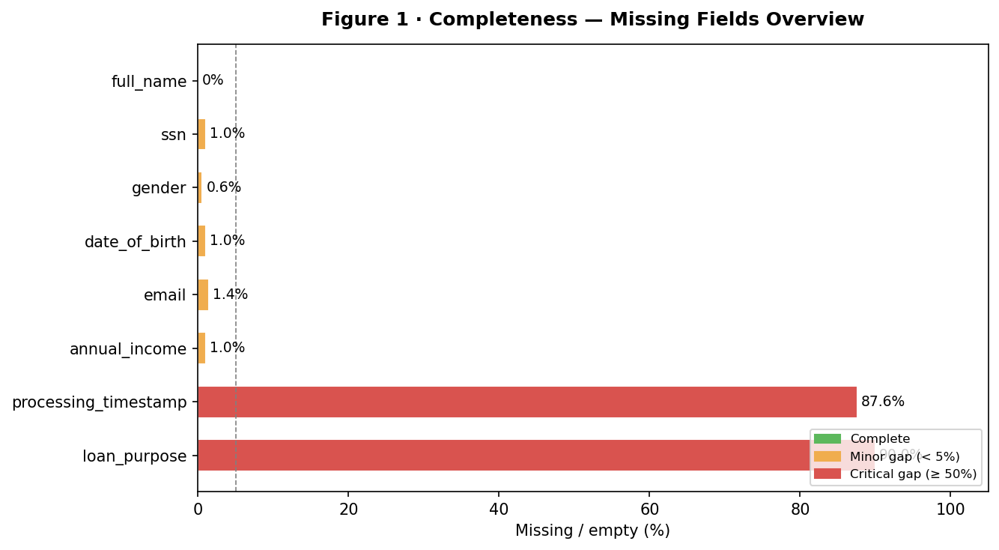
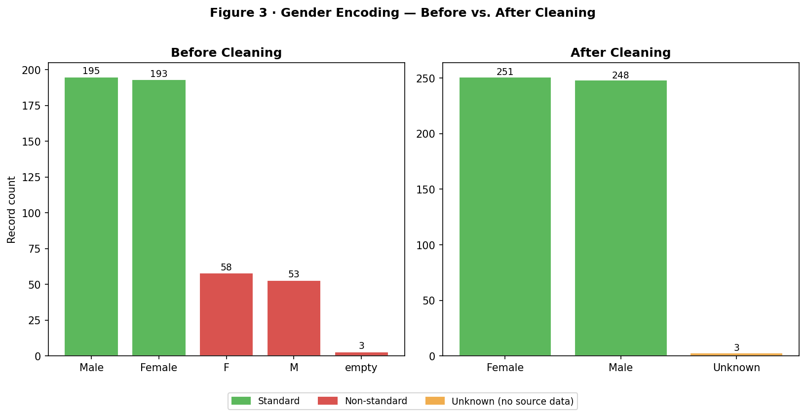

# Key Figures for Presentation

Figures selected for the 6-minute video presentation (DEGO 2606).
Structure: Intro (30s) · Data Quality (90s) · Bias (90s) · Governance (90s) · Conclusion (30s)

> **How to generate images:** Run Section 7 of `notebooks/01_data_quality_assessment.ipynb`.
> Figures 1 and 3 are saved automatically to `reports/figures/`. Figure 4 will be added once `02_bias_analysis.ipynb` is complete.

---

## SLIDE BLOCK 1 — Data Quality Findings (90 seconds)

### Figure 1 · Completeness — Missing Fields Overview
*Cite in video: "87.6% of records have no processing timestamp — a direct GDPR audit-trail gap."*

---

### Figure 2 · Uniqueness — Duplicate SSN Groups
*Cite in video: "3 SSN groups are duplicated — 2 involve completely different people sharing one SSN."*

| SSN | Records | Names | Risk |
|---|---|---|---|
| 937-72-8731 | 2 | Sandra Smith / Samuel Hill | Different people — potential fraud |
| 780-24-9300 | 2 | Susan Martinez / Gary Wilson | Different people — potential fraud |
| 652-70-5530 | 2 | Joseph Lopez / Joseph Lopez | Same name — likely duplicate entry |

Additionally: 2 duplicate application IDs (`app_042`, `app_001`).

---

### Figure 3 · Consistency — Gender Encoding Before vs. After Cleaning
*Cite in video: "22.7% of records used non-standard codes. Our pipeline corrected 111 values."*

---

## SLIDE BLOCK 2 — Bias Analysis Results (90 seconds)

### Figure 4 · Disparate Impact Ratio — Approval Rate by Gender
*Cite in video: "A DI ratio below 0.8 signals potential discrimination under the four-fifths rule."*

> **To be generated in `notebooks/02_bias_analysis.ipynb`.**
> Once complete, save the chart and replace this block with:
> ``

| Group | Approval Rate | DI Ratio | Threshold | Finding |
|---|---|---|---|---|
| *(to be computed)* | *(TBC)* | *(TBC)* | 0.8 | *(TBC)* |

---

## SLIDE BLOCK 3 — Governance Recommendations (90 seconds)

### Figure 5 · GDPR Gap Summary
*Cite in video: "SSNs stored in plaintext, no audit trail, and an ML system making high-stakes decisions — all GDPR and AI Act violations."*

| Finding | GDPR Obligation | Risk |
|---|---|---|
| 87.6% missing `processing_timestamp` | Art. 5(2) Accountability — audit trail | High |
| SSN stored in plaintext | Art. 25 Data Protection by Design | High |
| IP address stored without stated purpose | Art. 5(1)(b) Purpose Limitation | Medium |
| `loan_purpose` absent in 90% of records | Art. 5(1)(a) Transparency | Medium |
| ML-based loan decisions | EU AI Act Art. 6 — High-Risk AI System | High |

---

### Figure 6 · Governance Controls Roadmap
*Cite in video: "We propose five concrete controls, prioritised by risk level."*

| Priority | Control | Owner |
|---|---|---|
| Immediate | Pseudonymise SSN, email, IP address | Data Engineer |
| Immediate | Enforce `processing_timestamp` on all new records | Data Engineer |
| Short-term | Resolve `annual_income` vs `annual_salary` naming conflict | Data Engineer |
| Short-term | Duplicate SSN detection at ingestion | Data Engineer |
| Medium-term | Human oversight mechanism for algorithmic rejections | Governance Officer |
