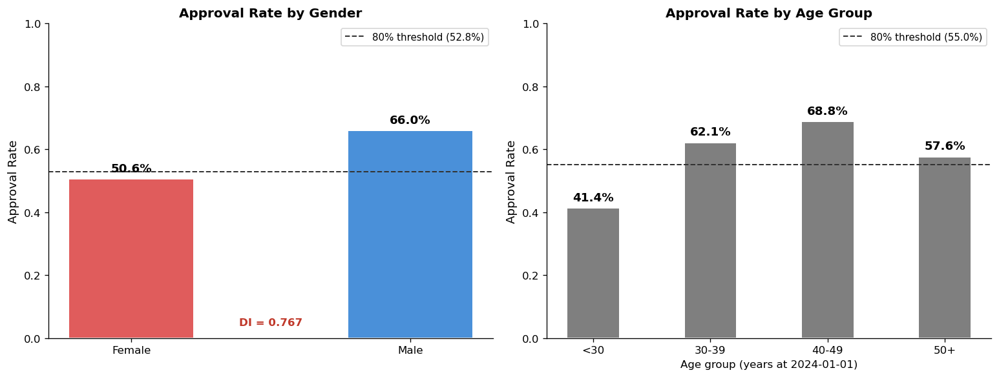
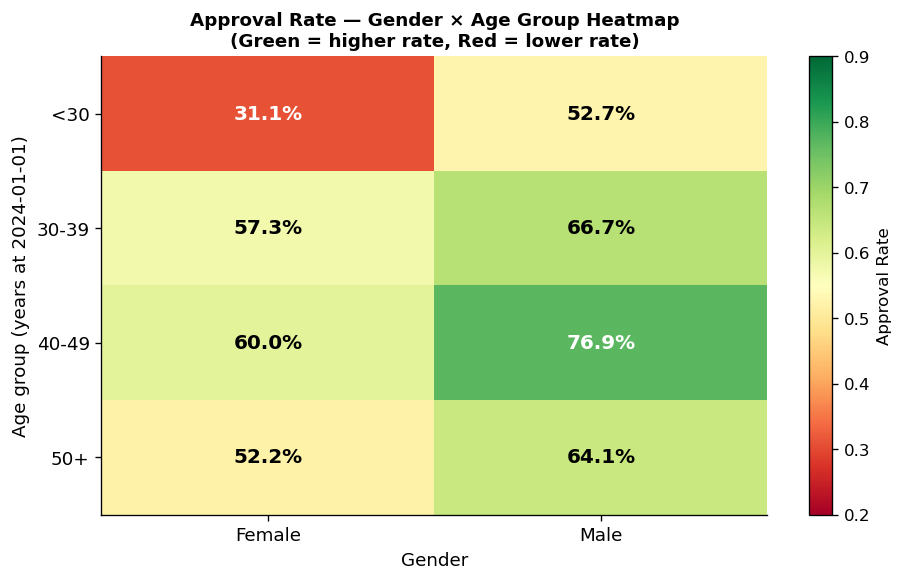
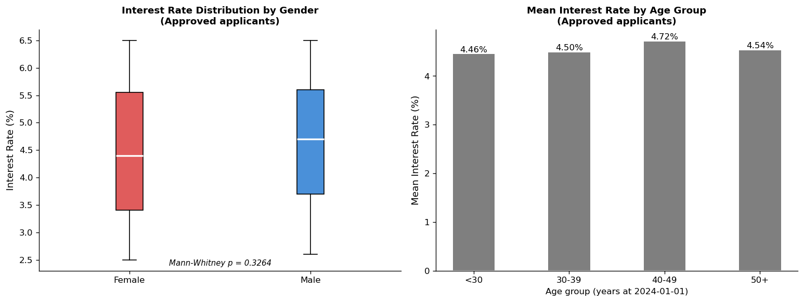

# Key Figures for Presentation

Figures selected for the 6-minute video presentation (DEGO 2606).
Structure: Intro (30s) · Data Quality (90s) · Bias (90s) · Governance (90s) · Conclusion (30s)

> **How to generate images:** Run `notebooks/01_data_quality_assessment.ipynb` (Figures 1–3) and `notebooks/02_bias_analysis.ipynb` (Figures 4–6). All figures are saved automatically to `reports/figures/`.

---

## SLIDE BLOCK 1 — Data Quality Findings (90 seconds)

### Figure 1 · Completeness — Missing Fields Overview
*Cite in video: "87.6% of records have no processing timestamp — a direct GDPR audit-trail gap."*

---

### Figure 2 · Uniqueness — Duplicate SSN Groups
*Cite in video: "3 SSN groups are duplicated — 2 involve completely different people sharing one SSN."*

| SSN | Records | Names | Risk |
|---|---|---|---|
| 937-72-8731 | 2 | Sandra Smith / Samuel Hill | Different people — potential fraud |
| 780-24-9300 | 2 | Susan Martinez / Gary Wilson | Different people — potential fraud |
| 652-70-5530 | 2 | Joseph Lopez / Joseph Lopez | Same name — likely duplicate entry |

Additionally: 2 duplicate application IDs (`app_042`, `app_001`).

---

### Figure 3 · Consistency — Gender Encoding Before vs. After Cleaning
*Cite in video: "22.7% of records used non-standard codes. Our pipeline corrected 111 values."*

---

## SLIDE BLOCK 2 — Bias Analysis Results (90 seconds)

### Figure 4 · Baseline Disparity — Approval Rate by Gender and Age Group
*Cite in video: "Female applicants are approved at 50.6% versus 66.0% for males — a Disparate Impact ratio of 0.77, below the 0.80 regulatory threshold. Applicants under 30 show the lowest approval rate of any age group."*

| Group | Approval Rate | DI Ratio | Threshold | Finding |
|---|---|---|---|---|
| Female | 50.6% | 0.767 | ≥ 0.80 | **FAIL — adverse impact** |
| Male | 66.0% | 1.000 | — | Reference group |
| Age <30 | 41.4% | 0.601 | ≥ 0.80 | **FAIL — adverse impact** |
| Age 40–49 | 68.8% | 1.000 | — | Highest rate |

---

### Figure 5 · Intersectional Effects — Gender × Age Group Heatmap
*Cite in video: "When we combine gender and age, the picture gets worse. Young female applicants are approved at just 31% — a Disparate Impact of 0.59 against their male peers. Two intersectional sub-groups breach the regulatory threshold."*

| Sub-group | Approval Rate | DI (Female ÷ Male) | Threshold | Finding |
|---|---|---|---|---|
| Female · <30 | 31.2% | 0.591 | ≥ 0.80 | **FAIL — most severe** |
| Female · 40–49 | 60.0% | 0.780 | ≥ 0.80 | **FAIL** |
| Female · 30–39 | 57.3% | 0.860 | ≥ 0.80 | Pass |
| Female · 50+ | 52.2% | 0.814 | ≥ 0.80 | Pass |

---

### Figure 6 · Pricing Fairness — Interest Rate Distribution by Gender
*Cite in video: "One positive finding: the pricing channel does not compound the approval disparity. No statistically significant interest rate difference was found by gender among approved applicants — Mann–Whitney p = 0.33."*

---

## SLIDE BLOCK 3 — Governance Recommendations (90 seconds)

### Figure 7 · GDPR & AI Act Gap Summary
*Cite in video: "SSNs stored in plaintext, no audit trail, an ML system making high-stakes credit decisions, and a conditional gender disparity that cannot be explained by financial risk — all GDPR and AI Act violations."*

| Finding | Regulatory Obligation | Risk |
|---|---|---|
| Gender OR = 2.01 in automated credit decisions | GDPR Art. 22 — automated decision-making | Critical |
| 87.6% missing `processing_timestamp` | GDPR Art. 5(2) — accountability / audit trail | High |
| SSN stored in plaintext | GDPR Art. 25 — data protection by design | High |
| ZIP code encodes gender (near-perfect proxy) | GDPR Art. 5(1)(c) — data minimisation | High |
| Sensitive spending categories without justified necessity | GDPR Art. 5(1)(c) · Art. 9 | Moderate |
| ML-based loan decisions | EU AI Act Annex III — high-risk AI system | High |

---

### Figure 8 · Governance Controls Roadmap
*Cite in video: "We propose seven concrete controls prioritised by risk level, covering both data quality and bias remediation."*

| Priority | Control | Owner |
|---|---|---|
| Immediate | Legal review + process audit for gender-based approval gap | Governance Officer |
| Immediate | Pseudonymise SSN, email, IP address | Data Engineer |
| Immediate | Enforce `processing_timestamp` on all new records | Data Engineer |
| Short-term | Exclude ZIP code from all decision inputs | Data Scientist |
| Short-term | Implement fairness constraints in underwriting model | Data Scientist |
| Short-term | DPO review of sensitive spending categories | Governance Officer |
| Ongoing | Annual bias audits — gender, age, intersectional dimensions | All roles |
